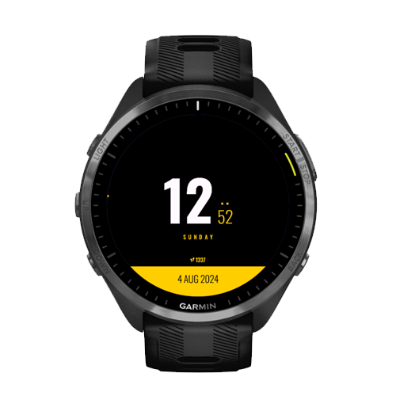

# Seaside

Seaside is an attempt at a minimalistic Garmin watch face. This is heavily
inspired by (copied form) the watch mockup by [Commissioner Of
design™](https://dribbble.com/shots/4945320-Digital-Watch-face/) since I
thought it looked so nice. The mockup exposes a
[Figma](https://www.figma.com/file/LtmMgqxkZYt072YPx3A65uyQ/Digital-Watch-face?node-id=0%3A1)
document where font and sizes can be found.

<p float="left">
    
    
    
</p>

## Font

The font used is [Oswald](https://fonts.google.com/specimen/Oswald). It's
created with [BMFont](http://www.angelcode.com/products/bmfont/) with unique
size per resolution. To get as little maintenance as possible, I tried to set
all padding with relativity to the size of the text. This works on most
resolutions but probably not all.

See each resource `.fnt` file for size.

### Icon map

The `small` font is manually patched with a glyph for bottom info icons. This
process is tedious and requires the step icon to be added to the font and
manually adding bounds for it.

| Icon | Char id | Character |
| ---- | ------- | --------- |
| Step | 35      | `#`       |

Pack steps icon into font small, manually tracing its boundaries.

### Weather icons

Weather icons are using the [Weather Icon
Font](https://erikflowers.github.io/weather-icons/)

## Features

-   Show current time, date and name of day
-   Multiple color selections
-   Configure when to show battery level (including always or never)
-   Option to increase font size for better readability
-   Option to show step count

## Links and References

-   [Connect IQ Programmers
    Guide](https://developer.garmin.com/connect-iq/programmers-guide/)
-   [API documentation](https://developer.garmin.com/connect-iq/api-docs/)
-   [Screen sizes](https://developer.garmin.com/connect-iq/compatible-devices/)

## Build and run

To build an run this code you must have the [Connect IQ
SDK](https://developer.garmin.com/connect-iq/sdk/) installed and add the `bin`
directory from the SDK to your `PATH`.

```sh
# Create an output directory
$ mkdir -p out/production/seaside

# Launch the simulator
$ connectiq

# Compile the watch face
$ monkeyc \
    -d vivoactive3 \
    -f monkey.jungle \
    -o out/production/seaside/seaside.prg \
    -y path/to/dev_key.der

# Run it in the simulator
$ monkeydo out/production/seaside/seaside.prg vivoactive3

# Package it for release
$ monkeyc \
    -e \
    -f monkey.jungle \
    -o my_app.iq \
    -y path/to/dev_key.der
```

### VS Code

Or just, as you probably should, install the [VS Code
Extension](https://marketplace.visualstudio.com/items?itemName=garmin.monkey-c)
and build that way.

Or, even better, install the [Prettier Extension Monkey
C](https://marketplace.visualstudio.com/items?itemName=markw65.prettier-extension-monkeyc)
which contains the [Monkey C
Optimizer](https://github.com/markw65/monkeyc-optimizer) to build an optimized
version.
