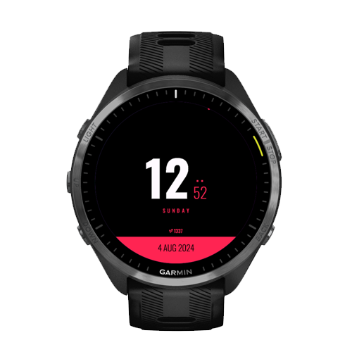

# Seaside

Seaside is an attempt at a minimalistic Garmin watch face. This is heavily
inspired by the watch mockup by [Commissioner Of
design™](https://dribbble.com/shots/4945320-Digital-Watch-face/) since I thought
it looked so nice. I'm still in the search of a better font and a better
implementation. The current fon't used is
[Nunito](https://fonts.google.com/specimen/Nunito) from Google. The font's has
been converted to bitmap fonts according to the [Resource
Compiler](https://developer.garmin.com/connect-iq/programmers-guide/resource-compiler)
documentation, however the recommended application
([BMFont](http://www.angelcode.com/products/bmfont/)) is only available for
Windows and I'm still looking for a good (free) alternative for macOS.

<p float="left">
    
    
    
</p>

## Features

-   Show current time, date and name of day
-   Multiple color selections
-   Toggle battery percentage
-   Show battery level in orange when less than or equal to 20%
-   Option to show step count

## Links and References

-   [Connect IQ Programmers
    Guide](https://developer.garmin.com/connect-iq/programmers-guide/)
-   [API documentation](https://developer.garmin.com/connect-iq/api-docs/)

## Build and run

To build an run this code you must have the [Connect IQ
SDK](https://developer.garmin.com/connect-iq/sdk/) installed and add the `bin`
directory from the SDK to your `PATH`.

```sh
# Create an output directory
$ mkdir -p out/production/seaside

# Launch the simulator
$ connectiq

# Compile the watch face
$ monkeyc \
    -d vivoactive3 \
    -f monkey.jungle \
    -o out/production/seaside/seaside.prg \
    -y path/to/dev_key.der

# Run it in the simulator
$ monkeydo out/production/seaside/seaside.prg vivoactive3

# Package it for release
$ monkeyc \
    -e \
    -f monkey.jungle \
    -o my_app.iq \
    -y path/to/dev_key.der
```

### VS Code

Or just, as you probably should, install the [VS Code
Extension](https://marketplace.visualstudio.com/items?itemName=garmin.monkey-c)
and build that way.

Or, even better, install the [Prettier Extension Monkey
C](https://marketplace.visualstudio.com/items?itemName=markw65.prettier-extension-monkeyc)
which contains the [Monkey C
Optimizer](https://github.com/markw65/monkeyc-optimizer) to build an optimized
version.
